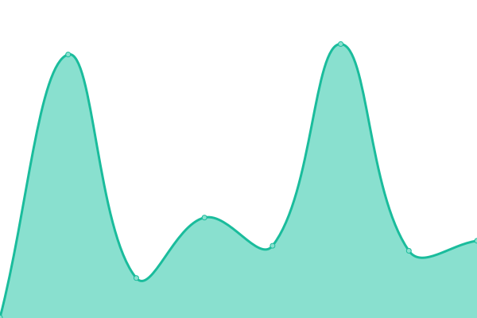
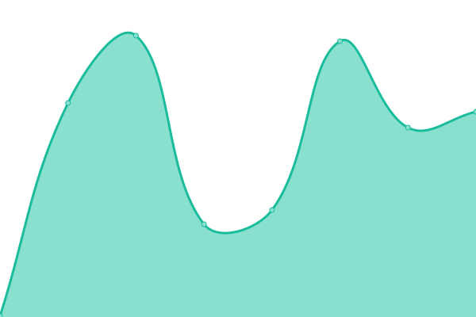

# [📈 Live Status](https://LakesideMiners.github.io/statuspage): <!--live status--> **🟧 Partial outage**

This repository contains the open-source uptime monitor and status page for [LakesideMiners](https://LakesideMiners.github.io/statuspage), powered by [Upptime](https://github.com/upptime/upptime).

With [Upptime](https://upptime.js.org), you can get your own unlimited and free uptime monitor and status page, powered entirely by a GitHub repository. I use [Actions](https://github.com/LakesideMiners/statuspage/actions) as uptime monitors, and [Pages](https://LakesideMiners.github.io/statuspage) for the status page.

<!--start: status pages-->
<!-- This summary is generated by Upptime (https://github.com/upptime/upptime) -->
<!-- Do not edit this manually, your changes will be overwritten -->
<!-- prettier-ignore -->
| URL | Status | History | Response Time | Uptime |
| --- | ------ | ------- | ------------- | ------ |
|  [Red's Server Root](https://redsserver.com) | 🟥 Down | [red-s-server-root.yml](https://github.com/LakesideMiners/statuspage/commits/HEAD/history/red-s-server-root.yml) | 

 90ms
     
 | 

<a href="https://lakesideminers.github.io/statuspage/history/red-s-server-root">100.00%</a>
    

|  [TheLounge](https://talk.redsserver.com) | 🟥 Down | [the-lounge.yml](https://github.com/LakesideMiners/statuspage/commits/HEAD/history/the-lounge.yml) | 

 80ms
     
 | 

<a href="https://lakesideminers.github.io/statuspage/history/the-lounge">100.00%</a>
    

|  [TinyTinyRSS](https://rss.redsserver.com) | 🟥 Down | [tiny-tiny-rss.yml](https://github.com/LakesideMiners/statuspage/commits/HEAD/history/tiny-tiny-rss.yml) | 

 74ms
     
 | 

<a href="https://lakesideminers.github.io/statuspage/history/tiny-tiny-rss">100.00%</a>
    

|  [Wikipedia En](https://en.wikipedia.org) | 🟩 Up | [wikipedia-en.yml](https://github.com/LakesideMiners/statuspage/commits/HEAD/history/wikipedia-en.yml) | 

 223ms
     
 | 

<a href="https://lakesideminers.github.io/statuspage/history/wikipedia-en">100.00%</a>
    

|  [Zoom Overall](https://status.zoom.us/api/v2/status.json) | 🟩 Up | [zoom-overall.yml](https://github.com/LakesideMiners/statuspage/commits/HEAD/history/zoom-overall.yml) | 

 208ms
     
 | 

<a href="https://lakesideminers.github.io/statuspage/history/zoom-overall">100.00%</a>
    

<!--end: status pages-->

[**Visit my status website →**](https://LakesideMiners.github.io/statuspage)

## 📄 License

- Powered by: [Upptime](https://github.com/upptime/upptime)
- Code: [MIT](./LICENSE) © [LakesideMiners](https://LakesideMiners.github.io/statuspage)
- Data in the `./history` directory: [Open Database License](https://opendatacommons.org/licenses/odbl/1-0/)
